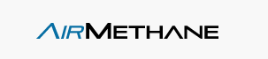

<p align="center">

</p>

# AirMethane External API

#### Quickstart for consuming the API - Examples
- [Python](examples/python/)
- [BASH](examples/bash/)
- [GUI Client (Insomnia)](examples/insomnia%20collection/)

### Accessing the API
- Base dev URL: `https://dev-api.axil.ai/airmethane/external/inspections`
- Base prod URL: `https://api.axil.ai/airmethane/external/inspections`
- Authorization: we use Auth0 to generate a JSON Web Token (JWT) that we use for Bearer authentication. To set up your Auth0 credentials, please contact support@flogistix.com. For how to generate your JWT, please see one of the examples.

The API is used by creating a path with your desired parameters and appending them to the base URLs above. The format looks like: 
```
<base_url>/<parameter1>/<parameter1_value>/<parameter2>/<parameter2_value>/...
```

Valid Parameters:
 - **orgs** integer derived from an inspection's "customerId" value, represents internal identifier of a customer's organization
 - **sites** integer derived from an inspection's "customerLocationId" value, represents internal identifier of a customer's location to be inspected
 - **id** integer, unique identifier of an inspection
 - **inspectonDate** ISO format YYYY-DD-MM, date an inspection took place
 - **inspectionDateAfter** ISO format YYYY-DD-MM, filters results for inspections that occured on or after this date
 - **inspectionDateBefore** ISO format YYYY-DD-MM, filters results for inspections that occured on or before this date

Details for how to use the parameters, what they represent, and how to interpret the responses are below.

## GET external/inspections 
Retrieve inspections by org (identifier for customer), site (identifier for customer's location), inspection date range, or inspection ID. Order of parameters in the path does not matter. This endpoint is intended for AirMethane customer usage only.

Note: usage of curly braces in examples should be excluded from the actual path when using the endpoint.

### Get all inspections a user has access to
```
GET external/inspections/
```
### Get inspections for a specific org
```
GET external/inspections/orgs/{customerId}
```
### Get inspections for a specific site
```
GET external/inspections/orgs/{customerId}/sites/{customerLocationId}
```
### Get inspections for a specific date range
```
GET external/inspections/inspectionDateAfter/{YYYY-MM-DD}/inspectionDateBefore/{YYYY-MM-DD}
```
Dates must be in ISO format YYYY-MM-DD
### Get inspections for a specific inspection ID
```
GET external/inspections/id/{99999}
```
### Combining options to one path (order NOT important!)
```
GET external/inspections/orgs/{customerId}/sites/{customerLocationId}/inspectionDateAfter/{YYYY-MM-DD}/inspectionDateBefore/{YYYY-MM-DD}
```
### Alternatively, you can use query strings
```
GET external/inspections?orgs={customerId}&sites={customerLocationId}&inspectionDateAfter={YYYY-MM-DD}&inspectionDateBefore={YYYY-MM-DD}
```
## Example Responses from API

### Successful response - response code 200
```JSON
{
    "inspections": [{
            "id": 1,
            "createdAt": "2023-09-12 20:06:42.681131",
            "createdBy": "Simba",
            "flogistixId": "GGOO_inspection_flogistix_id",
            "createdByEmail": "ggoof@flogistix.com",
            "createdByName": "Goofy Goof",
            "deletedAt": null,
            "inspectionDate": "2023-09-12 15:16:57",
            "statusId": 1,
            "status": {
                "id": 1,
                "code": "draft",
                "display": "Draft",
                "comment": "Inspection that is in draft state."
            },
            "inspectionType": "Voluntary",
            "state": "California",
            "county": "Orange County",
            "latitude": 110.0,
            "longitude": 111.0,
            "gps": "(110.0,111.0)",
            "inspectionFrequency": "Single",
            "startTime": "12:00:00",
            "endTime": "14:00:00",
            "contactName": "Mickey Mouse",
            "contactPhone": "555-555-5557",
            "contactEmail": "mmouse@flogistix.com",
            "contactApiNumber": null,
            "operationalStatus": "Disabled",
            "locationSignFile": {
				"name": "Disney Land Castle Visit",
				"sensorType": {
					"id": 3,
					"name": "Sniffer"
				},
				"fileType": "image",
				"downloadUrl": "https://airmethane-file-storage-dev.s3.amazonaws.com/Disneyland/Disneyland%20Castle/image/VentusOGI/08-20-2021/Disney%20Land%20Castle%20Visit.PNG?response-content-disposition=attachment%3B%20filename%3D%22Disney%20Land%20Castle%20Visit&response-content-type=image%2Fpng&presignedInfoHere&Expires=1701374755"
			},
            "verifications": [{
                    "id": 316,
                    "inspectionId": 3664,
                    "flowRate": 60.549999,
                    "altitude": 800.5,
					"surveyInstrumentId": 3,
					"surveyInstrument": {
                        "id": 3,
                        "name": "VentusOGI",
                        "serialNumber": "SN 630018",
                        "sensorType": {
                            "id": 7,
                            "name": "OGI"
                        }
                    },
                    "file": {
						"name": "dl_verif",
						"sensorType": {
                            "id": 7,
                            "name": "OGI"
                        },
						"fileType": "image",
						"downloadUrl": "https://airmethane-file-storage-dev.s3.amazonaws.com/dl_verif/image/VentusOGI/08-20-2021/dl_verif.PNG?response-content-disposition=attachment%3B%20filename%3D%22dl_verif&response-content-type=image%2Fpng&presignedInfoHere&Expires=1701374755"
					}
                }
            ],
            "siteConditions": {
                "id": 209,
                "inspectionId": 3664,
                "skyConditions": "Clear",
                "ambientTemperature": 25.5,
                "windDirection": "North",
                "maxWindSpeed": 12.3
            },
            "surveys": [{
                    "id": 361,
                    "inspectionId": 3664,
                    "inspectionDurationHours": 0,
                    "inspectionDurationMinutes": 25,
                    "altitude": 100,
                    "gimbalAngle": 45,
                    "method": {
                        "id": 1,
                        "name": "Aerial OGI"
                    },
                    "surveyInstrument": {
                        "id": 1,
                        "name": "FLIR GFX 320",
                        "serialNumber": "FAM007524",
                        "sensorType": {
                            "id": 7,
                            "name": "OGI"
                        }
                    },
                    "inspectors": [{
                            "id": 4,
                            "name": "Donald Duck",
                            "email": "dduck@flogistix.com",
                            "credentials": [{
                                    "id": 7,
                                    "credentials": "Remote Pilot",
                                    "licenseNumber": 4590579,
                                    "certificationExpiration": null
                                }, {
                                    "id": 8,
                                    "credentials": "OGI-1 Certified Thermographer",
                                    "licenseNumber": 150387365,
                                    "certificationExpiration": null
                                }
                            ]
                        },
						{
                            "id": 4,
                            "name": "Goofy Goof",
                            "email": "ggoof@flogistix.com",
                            "credentials": [{
                                    "id": 7,
                                    "credentials": "Remote Pilot",
                                    "licenseNumber": 4590580,
                                    "certificationExpiration": null
                                }, {
                                    "id": 8,
                                    "credentials": "OGI-1 Certified Thermographer",
                                    "licenseNumber": 150387366,
                                    "certificationExpiration": null
                                }
                            ]
                        }
                    ],
                    "leakDetections": [],
                    "files": [
						{
						"name": "survey_vid",
						"sensorType": {
							"id": 1,
							"name": "FLIR OGI"
						},
						"fileType": "video",
						"downloadUrl": "https://airmethane-file-storage-dev.s3.amazonaws.com/survey_vid/image/FLIROGI/08-20-2021/survey_vid.PNG?response-content-disposition=attachment%3B%20filename%3D%22survey_vid&response-content-type=image%2Fpng&presignedInfoHere&Expires=1701374755"
						},
						{
						"name": "survey_vid2",
						"sensorType": {
							"id": 3,
							"name": "Sniffer"
						},
						"fileType": "video",
						"downloadUrl": "https://airmethane-file-storage-dev.s3.amazonaws.com/survey_vid2/image/Sniffer/08-20-2021/survey_vid2.PNG?response-content-disposition=attachment%3B%20filename%3D%22survey_vid2&response-content-type=image%2Fpng&presignedInfoHere&Expires=1701374755"
						}
					]
                }, {
                    "id": 363,
                    "inspectionId": 3664,
                    "inspectionDurationHours": 1,
                    "inspectionDurationMinutes": 15,
                    "altitude": 1500,
                    "gimbalAngle": 48,
                    "method": {
                        "id": 3,
                        "name": "Laser"
                    },
                    "surveyInstrument": {
                        "id": 4,
                        "name": "Ventus OGI",
                        "serialNumber": "SN 630062",
                        "sensorType": {
                            "id": 7,
                            "name": "OGI"
                        }
                    },
                    "inspectors": [{
                            "id": 4,
                            "name": "Donald Duck",
                            "email": "dduck@flogistix.com",
                            "credentials": [{
                                    "id": 7,
                                    "credentials": "Remote Pilot",
                                    "licenseNumber": 4590579,
                                    "certificationExpiration": null
                                }, {
                                    "id": 8,
                                    "credentials": "OGI-1 Certified Thermographer",
                                    "licenseNumber": 150387365,
                                    "certificationExpiration": null
                                }
                            ]
                        },
						{
                            "id": 4,
                            "name": "Goofy Goof",
                            "email": "ggoof@flogistix.com",
                            "credentials": [{
                                    "id": 7,
                                    "credentials": "Remote Pilot",
                                    "licenseNumber": 4590580,
                                    "certificationExpiration": null
                                }, {
                                    "id": 8,
                                    "credentials": "OGI-1 Certified Thermographer",
                                    "licenseNumber": 150387366,
                                    "certificationExpiration": null
                                }
                            ]
                        }
                    ],
                    "leakDetections": [],
                    "files": []
                }, {
                    "id": 362,
                    "inspectionId": 3664,
                    "method": {
                        "id": 2,
                        "name": "Handheld OGI"
                    },
                    "surveyInstrument": {
                        "id": 3,
                        "name": "Ventus OGI",
                        "serialNumber": "SN 630018",
                        "sensorType": {
                            "id": 7,
                            "name": "OGI"
                        }
                    },
                    "inspectors": [{
                            "id": 4,
                            "name": "Donald Duck",
                            "email": "dduck@flogistix.com",
                            "credentials": [{
                                    "id": 7,
                                    "credentials": "Remote Pilot",
                                    "licenseNumber": 4590579,
                                    "certificationExpiration": null
                                }, {
                                    "id": 8,
                                    "credentials": "OGI-1 Certified Thermographer",
                                    "licenseNumber": 150387365,
                                    "certificationExpiration": null
                                }
                            ]
                        }
                    ],
                    "leakDetections": [{
                            "id": 101,
                            "name": "DIS-DET-002",
                            "leakId": 166,
                            "fileId": 6959,
                            "file": {
								"name": "leak_detected_gif",
								"sensorType": {
									"id": 3,
									"name": "Sniffer"
								},
								"fileType": "image",
								"downloadUrl": "https://airmethane-file-storage-dev.s3.amazonaws.com/leak_detected_gif/image/Sniffer/08-20-2021/leak_detected_gif.gif?response-content-disposition=attachment%3B%20filename%3D%22leak_detected_gif&response-content-type=image%2Fpng&presignedInfoHere&Expires=1701374755"
                            },
                            "inspectionSurveyId": 165,
                            "cleanConnectId": 0,
                            "volume": 300,
                            "time": 1500,
                            "rate": 100,
                            "rateUom": "PPMM",
                            "activity": null,
                            "status": null
                        }
                    ],
                    "files": []
                }
            ],
            "leaks": [{
                    "id": 871,
                    "tagNumber": "TAG555",
                    "inspectionId": 3664,
                    "componentType": "connector",
                    "componentTypeOther": null,
                    "componentSubtype": "seal",
                    "priority": "3 - Two Weeks",
                    "notes": "Minor leak observed during maintenance.",
                    "timestamp": "14:20:00",
                    "rate": 0.75000048,
                    "rateUom": "g/ph",
                    "leakRepairs": []
                }, {
                    "id": 870,
                    "tagNumber": "TAG1005",
                    "inspectionId": 3664,
                    "componentType": "instrument",
                    "componentTypeOther": null,
                    "componentSubtype": "blast wall",
                    "priority": "1 - Emergency Work",
                    "notes": "Component needs replacement.",
                    "timestamp": "10:30:00",
                    "rate": 5.6700001,
                    "rateUom": "g/ph",
                    "leakRepairs": [{
                            "id": 1322,
                            "leakId": 870,
                            "repaired": false,
                            "repairedBy": null,
                            "date": "2023-08-19T12:00:00",
                            "method": null,
                            "notes": null,
                            "fileId": null
                        }, {
                            "id": 1320,
                            "leakId": 870,
                            "repaired": true,
                            "repairedBy": "Donald Duck",
                            "date": "2023-08-19T10:00:00",
                            "method": "Welding",
                            "notes": "Applied epoxy to seal the leak.",
                            "fileId": null
                        }, {
                            "id": 1321,
                            "leakId": 870,
                            "repaired": false,
                            "repairedBy": "Goofy Goof",
                            "date": "2023-08-19T11:00:00",
                            "method": null,
                            "notes": "Leak too large to repair onsite.",
                            "fileId": null
                        }
                    ]
                }
            ],
            "monitoredComponents": [{
                    "id": 2,
                    "inspectionId": 3664,
                    "componentType": "compressor",
                    "difficultToMonitor": true,
                    "unsafeToMonitor": true,
                    "description": "Hard to reach."
                }, {
                    "id": 34,
                    "inspectionId": 3664,
                    "componentType": "flange",
                    "difficultToMonitor": true,
                    "unsafeToMonitor": true,
                    "description": "Couldn't find it, toxic fumes also in the vicinity."
                }
            ],
            "monitoringPlanDeviations": "None.",
            "files": [],
            "customer": {
                "customerId": 21912,
                "customerName": "Disneyland"
            },
            "customerLocation": {
                "customerLocationId": 124186,
                "customerLocationName": "Disneyland Castle"
            }
        }
    ],
    "executionTime": "1.85 sec"
}
```

### No results on generic search (like giving a date range) - response code 200
```JSON
{
    "inspections": [],
    "executionTime": "400.74 ms"
}
```

### No results on specific inspection ID requested - response code 404
```json
{
	"status": "Not Found",
	"message": "Could not find inspection with given ID.",
	"executionTime": "2.39 sec"
}
```

### Response Payload Glossary:

# Flogistix Inspection Data Glossary

This glossary provides an overview of the key terms and structures in the JSON inspection data provided to customers. Please reference the definitions below to better understand the example response payloads above.

## Top-Level Structure

- **inspections**: An array containing inspections returned by given parameters to the endpoint.
  - **id**: Unique identifier for the inspection.
  - **createdAt**: Date and time when the inspection was created in our system.
  - **createdBy**: User who created the inspection.
  - **flogistixId**: Unique identifier assigned by Flogistix to the inspection, for readability.
  - **createdByEmail**: Email address of the creator.
  - **createdByName**: Name of the creator.
  - **deletedAt**: Date and time if the inspection is deleted; otherwise, null.
  - **inspectionDate**: Date of the inspection.
  - **statusId**: Unique identifier for the inspection status.
  - **status**: Details about the inspection status.
    - **id**: Status identifier.
    - **code**: Status code.
    - **display**: Display name of the status, what you see in the AirMethane portal.
    - **comment**: Description of the status and what it means.
  - **inspectionType**: Type of inspection (OOOO, Voluntary).
  - **state**: State where the inspection took place.
  - **county**: County where the inspection took place.
  - **latitude**: Latitude of the inspection location.
  - **longitude**: Longitude of the inspection location.
  - **gps**: GPS coordinates of the inspection location.
  - **inspectionFrequency**: Frequency of the inspection.
  - **startTime**: Start time of the inspection.
  - **endTime**: End time of the inspection.
  - **contactName**: Name of the contact person for the customer's location.
  - **contactPhone**: Contact person's phone number.
  - **contactEmail**: Contact person's email address.
  - **contactApiNumber**: API number for contact (if available).
  - **operationalStatus**: Operational status of the site inspected.
  - **locationSignFile**: Image of the location taken on the day the inspection was conducted, typically of a sign on the property identifying the location.
    - **name**: Name of the file.
    - **sensorType**: Type of sensor used.
      - **id**: Sensor type identifier.
      - **name**: Sensor type name.
    - **fileType**: Type of file (e.g., image).
    - **downloadUrl**: URL for downloading the file.

## Inspection Details

- **verifications**: Array containing information about the survey instrument details.
  - **id**: Unique identifier for the verification.
  - **inspectionId**: Identifier linking the verification to an inspection.
  - **flowRate**: Flow rate observed during verification in g/ph.
  - **altitude**: Altitude at which instrument was tested in meters.
  - **surveyInstrumentId**: Identifier for instrument being tested.
  - **surveyInstrument**: Instrument used for the verification.
    - **id**: Instrument identifier.
    - **name**: Instrument name.
    - **serialNumber**: Serial number of the instrument.
    - **sensorType**: Type of sensor used.
      - **id**: Sensor type identifier.
      - **name**: Sensor type name.
  - **file**: File associated with the verification.
    - **name**: Name of the file.
    - **sensorType**: Type of sensor used.
      - **id**: Sensor type identifier.
      - **name**: Sensor type name.
    - **fileType**: Type of file (e.g., image).
    - **downloadUrl**: URL for downloading the file.

- **siteConditions**: Details about the weather on location during inspection.
  - **id**: Unique identifier for site conditions.
  - **inspectionId**: Identifier linking site conditions to an inspection.
  - **skyConditions**: Sky conditions during inspection.
  - **ambientTemperature**: Ambient temperature during inspection.
  - **windDirection**: Wind direction during inspection.
  - **maxWindSpeed**: Maximum wind speed in MPH during inspection.

- **surveys**: Array containing survey details. A survey is defined by each flight of our drones with recorded sensor information. An inspection can have several surveys with the same survey instrument, each marking an individual flyover.
  - **id**: Unique identifier for the survey.
  - **inspectionId**: Identifier linking the survey to an inspection.
  - **inspectionDurationHours**: Duration of the inspection in hours.
  - **inspectionDurationMinutes**: Duration of the inspection in minutes.
  - **altitude**: Altitude during the survey in feet.
  - **gimbalAngle**: Gimbal angle during the survey.
  - **method**: Method used for the survey.
    - **id**: Method identifier.
    - **name**: Method name.
  - **surveyInstrument**: Instrument used for the survey.
    - **id**: Instrument identifier.
    - **name**: Instrument name.
    - **serialNumber**: Serial number of the instrument.
    - **sensorType**: Type of sensor used.
      - **id**: Sensor type identifier.
      - **name**: Sensor type name.
  - **inspectors**: Array containing information about the individuals who performed the inspection.
    - **id**: Unique identifier for the inspector.
    - **name**: Name of the inspector.
    - **email**: Email address of the inspector.
    - **credentials**: Array containing the credentials of the inspector.
      - **id**: Credential identifier.
      - **credentials**: Credential name.
      - **licenseNumber**: License number associated with the credential.
      - **certificationExpiration**: Expiration date of the certification (if available).
  - **leakDetections**: Array containing details about leak detections. Leak detections are automatically identified leaks by using machine intelligence to analyze our sensor telemetry.
    - **id**: Unique identifier for the leak detection.
    - **name**: Name of the leak detection.
    - **leakId**: Identifier linking the leak detection to a leak. Leaks identified while on site may be identical to ones later detected via video processing.
    - **fileId**: Identifier linking the leak detection to a file. Usually a .gif of the leak occuring.
    - **file**: File associated with the leak detection.
      - **name**: Name of the file.
	  - **sensorType**: Type of sensor used.
	    - **id**: Sensor type identifier.
		- **name**: Sensor type name.
	  - **fileType**: Type of file (e.g., video).
	  - **downloadUrl**: URL for downloading the file.
    - **inspectionSurveyId**: Identifier linking the leak detection to an inspection survey.
    - **cleanConnectId**: Identifier linking the leak detection to a clean connect.
    - **volume**: Volume of the leak.
    - **time**: Time of the leak.
    - **rate**: Rate of the leak.
    - **rateUom**: Unit of measurement for the leak rate.
    - **activity**: Activity associated with the leak detection.
    - **status**: Status of the leak detection.
  - **files**: Array containing files associated with the survey.
    - **name**: Name of the file.
    - **sensorType**: Type of sensor used.
      - **id**: Sensor type identifier.
      - **name**: Sensor type name.
    - **fileType**: Type of file (e.g., video).
    - **downloadUrl**: URL for downloading the file.

## Leaks

- **leaks**: Array containing details about leaks identified during the inspection.
  - **id**: Unique identifier for the leak.
  - **tagNumber**: Unique identifier associated with the leak and physically attached to leaking component on location during inspection.
  - **inspectionId**: Identifier linking the leak to an inspection.
  - **componentType**: Generic type of component associated with the leak.
  - **componentTypeOther**: Other type of component, not covered by generic component type (if applicable).
  - **componentSubtype**: Subtype of the component associated with the leak.
  - **priority**: Priority level of the leak.
  - **notes**: Additional notes about the leak.
  - **timestamp**: Timestamp when the leak was observed.
  - **rate**: Rate of the leak.
  - **rateUom**: Unit of measurement for the leak rate.
  - **leakRepairs**: Array containing details about leak repairs.
    - **id**: Unique identifier for the leak repair.
    - **leakId**: Identifier linking the repair to a leak.
    - **repaired**: Indicates whether the leak has been repaired.
    - **repairedBy**: Name of the person who performed the repair.
    - **date**: Date and time when the repair occurred.
    - **method**: Method used for the repair.
    - **notes**: Additional notes about the repair.
    - **fileId**: Identifier linking the repair to a file.
	- **files**: Array containing files associated to the repair.
		- **name**: Name of the file.
		- **sensorType**: Type of sensor used.
			- **id**: Sensor type identifier.
			- **name**: Sensor type name.
		- **fileType**: Type of file (e.g., video).
    	- **downloadUrl**: URL for downloading the file.

## Monitored Components

- **monitoredComponents**: Array containing details about components monitored during the inspection, as dictated by your monitoring plan.
  - **id**: Unique identifier for the monitored component.
  - **inspectionId**: Identifier linking the monitored component to an inspection.
  - **componentType**: Type of the monitored component.
  - **difficultToMonitor**: Indicates if the component is difficult to monitor.
  - **unsafeToMonitor**: Indicates if it is unsafe to monitor the component.
  - **description**: Additional description of the monitored component.

## Monitoring Plan Deviations

- **monitoringPlanDeviations**: Deviations from the monitoring plan (if any).

## Customer Information

- **customer**: Details about the customer.
  - **customerId**: Unique identifier for the customer.
  - **customerName**: Name of the customer.

- **customerLocation**: Details about the customer's location.
  - **customerLocationId**: Unique identifier for the customer's location.
  - **customerLocationName**: Name of the customer's location.

## Execution Time

- **executionTime**: Time taken for the execution of the inspection data retrieval, does not account for any network latency between API and user.


### Response Codes:
**200**: Inspections list  
**400**: Bad Request Error - the path is malformed  
**401**: Unauthorized Error    
**403**: Forbidden Error - the request is missing email/token  
**404**: Not Found Error   
**500**: Unknown Error - hopefully this one won't be returned!  
**503**: Upstream Service Error 